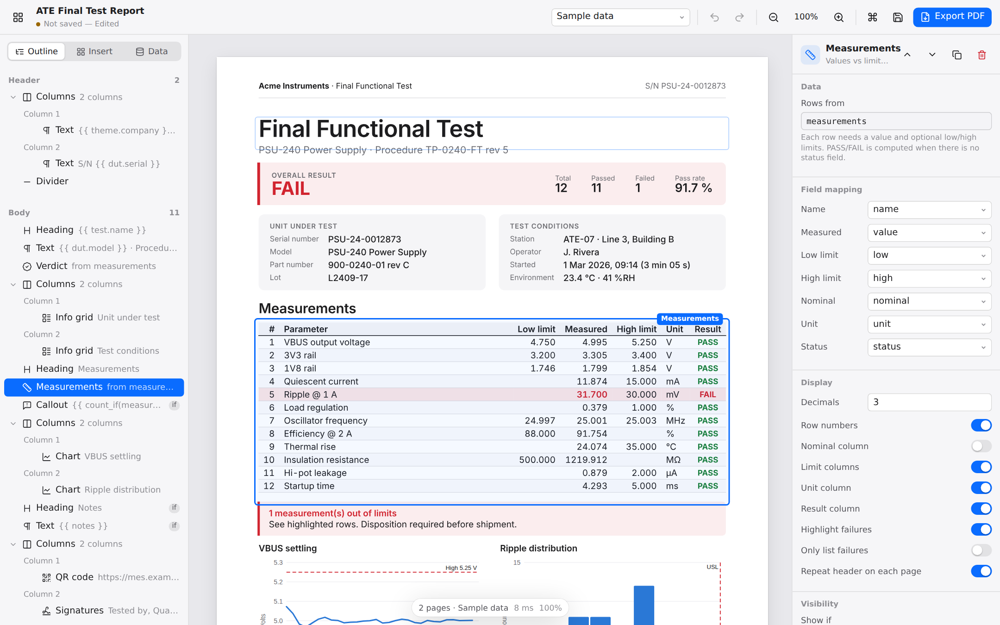

# Report Builder

**Design test reports visually. Render them from LabVIEW, Python, C# or the command line, offline,
in milliseconds, identically on every machine.**



Report Builder is a local-first desktop app and rendering engine for data-driven test
documentation: end-of-line test reports, calibration certificates, first-article inspections and
certificates of conformance. Design a template once; your test station sends JSON and gets a PDF.

- **What you see is what prints.** The editor preview comes from the same engine that renders
  production PDFs, so they are pixel-identical.
- **Reports that flow with your data.** Long measurement tables break across pages and repeat
  their headers. Sections can repeat per channel or per DUT. Headers, footers and "Page X of Y"
  are built in. You never position anything by hand.
- **Test-native blocks.** Measurement tables with automatic PASS/FAIL against limits, verdict
  banners with pass rate, spec grids, charts with limit lines, histograms, gauges, QR codes and
  barcodes, and signature blocks.
- **No browser, no server, no network.** A single Rust engine with embedded typesetting (Typst)
  and bundled fonts. It renders a 2-page report in about 35 ms, and can write PDF/A-2b for
  archives.
- **Built for LabVIEW.** Call `reportbuilder.dll` from a Call Library Function Node, or run
  `report-cli` from System Exec. The C ABI is also usable from TestStand, Python, C#, C and MATLAB.

## Get started

### Desktop app

Download the installer for Windows, macOS or Linux from
[Releases](https://github.com/zeshanabdullah10/ReportBuilder/releases). Pick a starter from the
gallery, then:

1. **Insert** blocks from the library (or press <kbd>⌘/Ctrl</kbd>+<kbd>K</kbd>). Drag them to
   reorder, or into columns and sections.
2. **Bind** fields: type `{{` in any text field for autocomplete from your data.
3. **Check** edge cases with the data-set switcher: your sample data, a generated *stress test*
   with long lists, and *empty* data for missing fields.
4. **Save** the template (`.rbt.json`) and **Export PDF** to check the final output.

### From LabVIEW

```
status = rb_render(template_path, data_json, output_pdf, "{\"pdfa\":true}", result, 4096)
```

The complete setup, including Call Library Function Node settings, building JSON from clusters,
error codes and TestStand, is in the **[LabVIEW integration guide](integrations/labview/README.md)**.

### From the command line

```bash
report-cli render -t FinalTest.rbt.json -d SN123.json -o reports/SN123.pdf --pdfa
report-cli batch  -t FinalTest.rbt.json --data-dir runs/ --out-dir reports/ --name "{{ dut.serial }}"
report-cli validate -t FinalTest.rbt.json -d SN123.json --strict
```

See the [CLI reference](docs/cli.md). Exit codes are stable (0 ok, 1 I/O, 2 validation,
3 render) for use in scripts.

### From Python / C#

```python
from reportbuilder import ReportBuilder
ReportBuilder().render("FinalTest.rbt.json", {"dut": {"serial": "SN123"}, "measurements": [...]}, "SN123.pdf")
```

Bindings: [`integrations/python`](integrations/python/reportbuilder.py) ·
[`integrations/csharp`](integrations/csharp/ReportBuilder.cs) ·
C header: [`reportbuilder.h`](engine/reportcore-ffi/include/reportbuilder.h)

## Data

Send any JSON; field names are up to you. A measurement table only needs rows like
`{"name": "VBUS", "value": 5.01, "low": 4.75, "high": 5.25, "unit": "V"}`. PASS/FAIL, counts and
pass rate are computed for you. Expressions add formatting and logic:

```
{{ vbus | fixed(3) }} V · {{ date(test.start, 'D MMM YYYY HH:mm') }} · {{ pass_rate(measurements) | percent(1) }}
```

Read more: [expressions](docs/expressions.md) · [template format](docs/template-format.md) ·
[architecture](docs/architecture.md)

## Development

```bash
# Engine, CLI, LabVIEW library
cargo test --workspace            # Linux: needs libwebkit2gtk-4.1-dev for the desktop crate
cargo build --release -p report-cli -p reportcore-ffi

# Desktop app
cd desktop && npm install
npm run tauri dev                 # native app with hot reload
npm test                          # unit tests (Vitest)
npx playwright test               # end-to-end tests against report-cli serve
```

| Path | Contents |
|---|---|
| `engine/reportcore` | Engine: model, expressions, validation, charts, Typst layout, PDF/SVG |
| `engine/report-cli` | `report-cli` binary and local HTTP API |
| `engine/reportcore-ffi` | C ABI (`reportbuilder.dll`/`.so`/`.dylib`) and header |
| `desktop` | Tauri 2 desktop app (React + TypeScript editor, Rust shell) |
| `integrations` | LabVIEW guide, Python and C# bindings |

## License

MIT. Bundled fonts: Inter, Libertinus Serif (SIL OFL 1.1) and DejaVu Sans Mono (Bitstream Vera
license); see `engine/reportcore/fonts`.
