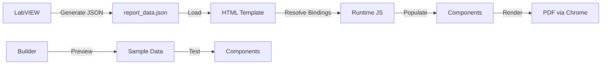

# JSON Data Integration Plan

## Overview

This plan outlines the implementation for parsing actual data from JSON files in the LabVIEW Report Builder. The goal is to create a comprehensive sample JSON file that tests all report components.

## Components to Test

Based on the user's requirements, the sample JSON should support:

| Component | Data Binding Path | Description |
|-----------|------------------|-------------|
| **Text** (Header) | `{{data.meta.reportTitle}}` | Report title/header text |
| **Date/Time** | `{{data.testInfo.testDate}}` | Test execution date |
| **Page Number** | Automatic | No data binding needed |
| **Table** | `{{data.measurements}}` | Measurement results table |
| **Chart** (Bar/Line) | `{{data.chartData}}` | Test results chart |
| **Scatter Plot** | `{{data.scatterData}}` | X/Y data points |
| **Indicator** (Pass/Fail) | `{{data.status.overall}}` | Overall pass/fail status |
| **Test Summary Box** | Multiple bindings | Test summary with counts |
| **Gauge** | `{{data.gaugeData.mainVoltage}}` | Analog gauge display |
| **Progress Bar** | `{{data.progress.completion}}` | Completion percentage |
| **Histogram** | `{{data.histogramData}}` | Distribution data |
| **Spec Box** | `{{data.specifications}}` | Specification comparison |

## Sample JSON Structure

```json
{
  "meta": {
    "reportTitle": "PCB Assembly Test Report",
    "reportVersion": "1.0",
    "generatedBy": "LabVIEW Test System",
    "projectName": "Project Alpha - Rev 2.1"
  },
  
  "testInfo": {
    "testName": "PCB Functional Test",
    "testDate": "2026-02-24T14:30:00",
    "operator": "John Smith",
    "workOrder": "WO-2026-0224-001",
    "serialNumber": "SN-PCB-001234",
    "stationId": "TEST-STN-05"
  },
  
  "summary": {
    "totalTests": 150,
    "passed": 142,
    "failed": 5,
    "skipped": 3,
    "passRate": 94.67,
    "overallStatus": "pass",
    "testDuration": "00:12:45"
  },
  
  "measurements": [
    { "id": 1, "name": "Voltage Ch1", "nominal": 5.0, "measured": 5.02, "unit": "V", "tolerance": "±5%", "status": "pass" },
    { "id": 2, "name": "Voltage Ch2", "nominal": 3.3, "measured": 3.31, "unit": "V", "tolerance": "±5%", "status": "pass" }
    // ... more measurements
  ],
  
  "chartData": {
    "labels": ["Test 1", "Test 2", ...],
    "values": [95, 87, 92, ...]
  },
  
  "scatterData": [
    { "x": 1.0, "y": 5.02, "label": "V1" },
    // ... more points
  ],
  
  "status": {
    "overall": "pass",
    "voltageTest": "pass",
    "currentTest": "warning"
  }
}
```

## Implementation Tasks

### 1. Create Sample JSON File
- **File**: `sample-data/component-test-sample.json`
- **Purpose**: Comprehensive test data for all components
- **Contains**: Meta info, test info, measurements, chart data, status indicators

### 2. Add to SampleDataLoader Templates
- **File**: `components/builder/topbar/SampleDataLoader.tsx`
- **Action**: Add new template entry to `SAMPLE_DATA_TEMPLATES` array
- **Template ID**: `component-test-sample`

### 3. Test Each Component Type

#### Text Component
- Binding: `{{data.meta.reportTitle}}` → "PCB Assembly Test Report"
- Inline text: `Report: {{data.testInfo.testName}}` → "Report: PCB Functional Test"

#### DateTime Component
- Binding: `{{data.testInfo.testDate}}` → "2026-02-24T14:30:00"
- Format: "MMMM dd, yyyy" → "February 24, 2026"

#### Table Component
- Binding: `{{data.measurements}}` → Array of measurement objects
- Auto-generate columns: id, name, nominal, measured, unit, tolerance, status

#### Chart Component
- Binding: `{{data.chartData}}` → Object with labels and values arrays
- Type: Bar or Line chart

#### Indicator Component
- Binding: `{{data.status.overall}}` → "pass"
- Displays: Green PASS indicator

#### Test Summary Box
- Total Tests Binding: `{{data.summary.totalTests}}` → 150
- Passed Binding: `{{data.summary.passed}}` → 142
- Failed Binding: `{{data.summary.failed}}` → 5
- Status Binding: `{{data.summary.overallStatus}}` → "pass"

### 4. Runtime Data Loading

The exported HTML already supports:
1. **Embedded sample data**: Included in HTML when `includeSampleData: true`
2. **External JSON file**: Loaded from `./report_data.json` at runtime
3. **Binding resolution**: `{{data.path}}` syntax resolved by runtime JavaScript

## Data Binding Syntax

### Simple Binding
```
{{data.meta.reportTitle}}
```

### Nested Path Binding
```
{{data.testInfo.operator}}
```

### Array Binding (for tables)
```
{{data.measurements}}
```

### Inline Interpolation
```
Test: {{data.testInfo.testName}} - Status: {{data.status.overall}}
```

## Files to Modify

1. **Create**: `sample-data/component-test-sample.json`
2. **Modify**: `components/builder/topbar/SampleDataLoader.tsx` - add template

## Next Steps

1. Switch to Code mode to create the JSON file
2. Update SampleDataLoader.tsx with the new template
3. Test in the builder with each component type
4. Verify export produces correct HTML with data bindings

## Mermaid Diagram: Data Flow



## Component Binding Reference

| Component | Primary Binding Prop | Expected Data Type |
|-----------|---------------------|-------------------|
| Text | `binding` or inline `{{}}` | string |
| DateTime | `binding` | ISO date string |
| Table | `binding` | array of objects |
| Chart | `binding` | `{labels: [], values: []}` |
| ScatterPlot | `binding` | `[{x, y, label}]` |
| Indicator | `binding` | `'pass' / 'fail' / 'warning'` |
| TestSummaryBox | `totalTestsBinding`, `passedBinding`, etc. | numbers |
| Gauge | `binding` | number |
| ProgressBar | `binding` | number (0-100) |
| SpecBox | `binding` | array of spec objects |
