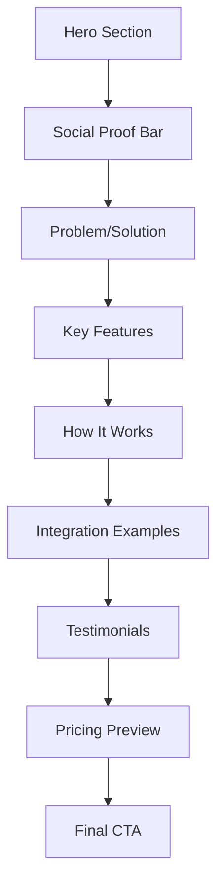
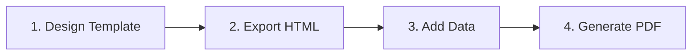

# Marketing Page Redesign Plan

## Executive Summary

This document outlines a complete redesign of the marketing page content for the Report Builder application. The redesign focuses on broadening the target audience beyond LabVIEW to all test engineers and ATE systems, while emphasizing three core value propositions: visual design, offline capability, and universal integration.

---

## Current State Analysis

### Current Structure
1. **Hero** - LabVIEW-focused messaging
2. **Features** - 6 component-based features
3. **How It Works** - 3-step workflow
4. **CTA** - Final conversion section

### Key Issues to Address
1. **Too LabVIEW-centric** - Messaging excludes Python, C#, and other test frameworks
2. **DIAdem comparison** - Unnecessary positioning against a different tool category
3. **Missing social proof** - No testimonials or trust indicators
4. **Weak problem/solution framing** - Jumps straight to features without context
5. **Limited use cases** - Does not show integration examples

---

## Proposed Redesign

### New Page Structure



---

## Section-by-Section Redesign

### 1. Hero Section

**Purpose:** Capture attention with a broad, compelling value proposition

**Current Headline:**
> Professional Reports for LabVIEW

**New Headline Options:**
> **Option A:** Test Reports That Design Themselves
> **Option B:** From Test Data to PDF in Minutes, Not Hours
> **Option C:** Professional Test Reports. No Code Required.

**New Subheadline:**
> Design report templates visually in your browser. Export self-contained HTML files that generate PDFs offline. Works with JSON data from any programming language.

**Key Changes:**
- Remove LabVIEW-specific language
- Emphasize visual design + offline + universal
- Add animated demo preview of the builder

**New Trust Indicators:**
- Works with: Python, C#, LabVIEW, MATLAB, etc.
- 100% Offline PDF Generation
- Self-Contained HTML Templates

---

### 2. Social Proof Bar (NEW)

**Purpose:** Build immediate credibility

**Content:**
```
Trusted by engineers at:
[Company Logo] [Company Logo] [Company Logo]

⚡ 10,000+ reports generated
⚡ 500+ templates created
⚡ Zero server dependencies
```

**Design Notes:**
- Subtle, non-intrusive placement below hero
- Animated counter for statistics
- Placeholder logos until real customers available

---

### 3. Problem/Solution Section (NEW)

**Purpose:** Create emotional connection by addressing pain points

**Problem Statement:**
> **The Old Way:**
> - Manually format reports in Word or Excel
> - Copy-paste test data every time
> - Inconsistent formatting across reports
> - Dependencies on specific software installations

**Solution Statement:**
> **The Better Way:**
> - Design once, generate forever
> - JSON data binding auto-populates fields
> - Consistent professional formatting
> - Self-contained HTML works anywhere

**Visual Design:**
- Split comparison layout
- Left side: cluttered, frustrated
- Right side: clean, streamlined
- Animated transition between states

---

### 4. Features Section (ENHANCED)

**Purpose:** Showcase capabilities organized by value proposition

**New Structure - 3 Categories:**

#### Visual Design
| Feature | Description |
|---------|-------------|
| Drag-Drop Builder | Intuitive canvas for template design |
| Component Library | Tables, charts, indicators, and more |
| Real-time Preview | See changes instantly as you design |
| Custom Styling | Fonts, colors, and branding options |

#### Offline Capability
| Feature | Description |
|---------|-------------|
| Self-Contained HTML | All assets embedded in single file |
| No Server Required | Generate PDFs without internet |
| Headless Chrome | Industry-standard PDF rendering |
| Version Control Ready | Track template changes in Git |

#### Universal Integration
| Feature | Description |
|---------|-------------|
| JSON Data Binding | Connect any data source |
| Multi-Language Support | Python, C#, LabVIEW, MATLAB |
| REST API | Programmatic template management |
| Webhook Support | Automated report generation |

---

### 5. How It Works (ENHANCED)

**Purpose:** Simplify the workflow understanding

**New 4-Step Flow:**



**Step Details:**

1. **Design Template**
   - Use visual builder to create layout
   - Drag components onto canvas
   - Define data bindings with {{variable}} syntax
   - Style to match your brand

2. **Export HTML**
   - Download self-contained HTML file
   - All dependencies embedded
   - Works offline, no server needed

3. **Add Your Data**
   - Write JSON from any language
   - Python, C#, LabVIEW, MATLAB, etc.
   - Data auto-fills template placeholders

4. **Generate PDF**
   - Call headless Chrome from your code
   - PDF renders exactly as designed
   - Automate with your test pipeline

---

### 6. Integration Examples (NEW)

**Purpose:** Show practical code examples for different languages

**Python Example:**
```python
import json
import subprocess

# Your test data
data = {
    "test_name": "Temperature Stress Test",
    "result": "PASS",
    "measurements": [23.5, 24.1, 23.8]
}

# Write data to JSON
with open('data.json', 'w') as f:
    json.dump(data, f)

# Generate PDF
subprocess.run([
    'chrome', '--headless', '--print-to-pdf=report.pdf',
    '--inject-data=data.json', 'template.html'
])
```

**C# Example:**
```csharp
var data = new {
    test_name = "Voltage Test",
    result = "PASS",
    measurements = new[] { 5.1, 5.0, 5.2 }
};

File.WriteAllText("data.json", JsonSerializer.Serialize(data));

// Generate PDF with Process.Start calling Chrome
```

**LabVIEW Example:**
- JSON text file write
- System Exec VI for Chrome call
- File path output for PDF

---

### 7. Testimonials Section (NEW)

**Purpose:** Build trust through social proof

**Structure:**
- 3 testimonial cards
- Photo, name, title, company
- Quote about specific benefit

**Placeholder Testimonials:**
> "Cut our report generation time from 2 hours to 5 minutes. The visual builder is intuitive enough for our interns to use."
> — Test Engineer, Aerospace Company

> "Finally, a reporting tool that works offline. Our secure facilities have no internet access, and this fits perfectly."
> — QA Manager, Defense Contractor

> "The JSON integration meant we didn't have to change our Python test framework at all. Just write data and generate."
> — Automation Lead, Semiconductor Company

---

### 8. Pricing Preview (NEW)

**Purpose:** Show clear, simple credit-based pricing to reduce friction

**Content:**
```
Starter Pack                 Pro Pack                    Team Pack
$19 one-time                 $39 one-time                $69 one-time

10 clean exports             25 clean exports            50 clean exports
No watermark                 No watermark                No watermark
Credits never expire         Credits never expire        Credits never expire
Priority support             Priority support            Priority support
                             37% savings                 48% savings

[Buy Now]                    [Buy Now] ⭐ Best Value     [Buy Now]
```

**Design Notes:**
- Three-column comparison using existing pricing cards
- Highlight Pro Pack as best value
- Show savings percentage on larger packs
- Link to full pricing page for details

---

### 9. Final CTA (ENHANCED)

**Purpose:** Convert visitors with clear next steps

**Headline:**
> Start Building Reports in Minutes

**Subheadline:**
> No credit card required. Free tier includes 1 template.

**Primary CTA:**
> [Get Started Free →]

**Secondary CTA:**
> [View All Features] [Contact Sales]

**Trust Reminders:**
- ✓ Free forever tier available
- ✓ No credit card required
- ✓ Works offline
- ✓ Cancel anytime

---

## Content Style Guidelines

### Tone
- **Professional but approachable** - Not overly corporate or casual
- **Technical but not jargon-heavy** - Accessible to all engineers
- **Confident but not arrogant** - Focus on benefits, not comparisons

### Language
- Use "you" and "your" frequently
- Focus on outcomes, not features
- Use active voice
- Keep sentences under 20 words
- Avoid acronyms without explanation

### Formatting
- Use bullet points for scannability
- Include code examples where relevant
- Add visual hierarchy with headings
- Use the existing oscilloscope theme colors

---

## Visual Hierarchy Principles

1. **F-Pattern Reading Flow**
   - Important info on left
   - Headlines and CTAs prominent
   - Supporting content to the right

2. **Contrast for Emphasis**
   - Cyan (#00ffc8) for CTAs
   - Green (#39ff14) for positive indicators
   - Amber (#ffb000) for warnings/notes

3. **Whitespace**
   - Generous padding between sections
   - Don't crowd content
   - Let animations breathe

4. **Progressive Disclosure**
   - Start with high-level benefits
   - Reveal technical details on scroll
   - Full documentation linked, not embedded

---

## Implementation Tasks

### Phase 1: Core Content Updates
- [ ] **Update [`hero.tsx`](../components/marketing/hero.tsx)**
  - Change headline from LabVIEW-focused to universal
  - Update subheadline to emphasize visual + offline + universal
  - Replace trust indicators with language logos
  - Keep oscilloscope visual theme

- [ ] **Revise [`features.tsx`](../components/marketing/features.tsx)**
  - Reorganize into 3 categories: Visual Design, Offline, Integration
  - Update feature descriptions for broader audience
  - Keep existing animation and styling

- [ ] **Enhance [`how-it-works.tsx`](../components/marketing/how-it-works.tsx)**
  - Change from 3 to 4 steps
  - Update descriptions to be language-agnostic
  - Add code snippet previews

### Phase 2: New Sections
- [ ] **Create [`social-proof.tsx`](../components/marketing/social-proof.tsx)**
  - Statistics: reports generated, templates created
  - Placeholder company logos
  - Animated counters

- [ ] **Create [`problem-solution.tsx`](../components/marketing/problem-solution.tsx)**
  - Side-by-side comparison layout
  - Old way vs new way messaging
  - Animated transition effect

- [ ] **Create [`integrations.tsx`](../components/marketing/integrations.tsx)**
  - Python code example
  - C# code example
  - LabVIEW block diagram reference
  - Syntax highlighting

### Phase 3: Conversion Optimization
- [ ] **Create [`testimonials.tsx`](../components/marketing/testimonials.tsx)**
  - 3 placeholder testimonials
  - Card-based layout with photos
  - Carousel optional

- [ ] **Create [`pricing-preview.tsx`](../components/marketing/pricing-preview.tsx)**
  - Reuse existing PricingCards component
  - Add section wrapper and context
  - Link to full pricing page

- [ ] **Update [`cta.tsx`](../components/marketing/cta.tsx)**
  - Stronger headline
  - Multiple trust reminders
  - Secondary CTAs

### Phase 4: Page Assembly
- [ ] **Update [`page.tsx`](../app/(marketing)/page.tsx)**
  - Import all new components
  - Arrange in correct order
  - Test responsive layout

---

## Files to Modify

| File | Changes |
|------|---------|
| [`components/marketing/hero.tsx`](../components/marketing/hero.tsx) | New headline, copy, trust indicators |
| [`components/marketing/features.tsx`](../components/marketing/features.tsx) | Reorganized 3-category structure |
| [`components/marketing/how-it-works.tsx`](../components/marketing/how-it-works.tsx) | 4-step flow with code examples |
| [`components/marketing/cta.tsx`](../components/marketing/cta.tsx) | Enhanced final CTA |
| [`app/(marketing)/page.tsx`](../app/(marketing)/page.tsx) | Add new sections |
| **NEW** `components/marketing/social-proof.tsx` | Statistics and logos |
| **NEW** `components/marketing/problem-solution.tsx` | Comparison section |
| **NEW** `components/marketing/integrations.tsx` | Code examples |
| **NEW** `components/marketing/testimonials.tsx` | Customer quotes |
| **NEW** `components/marketing/pricing-preview.tsx` | Quick pricing comparison |

---

## Success Metrics

After implementation, track:
- **Bounce Rate** - Target: < 50%
- **Time on Page** - Target: > 2 minutes
- **Signup Conversion** - Target: > 3%
- **Scroll Depth** - Target: 80% reach CTA

---

## Questions for Review

1. Is the broader positioning (beyond LabVIEW) appropriate?
2. Should we keep the oscilloscope theme or modernize it?
3. Do you have real customer testimonials to use?
4. What is the actual pricing structure?
5. Any specific integration examples to prioritize?
