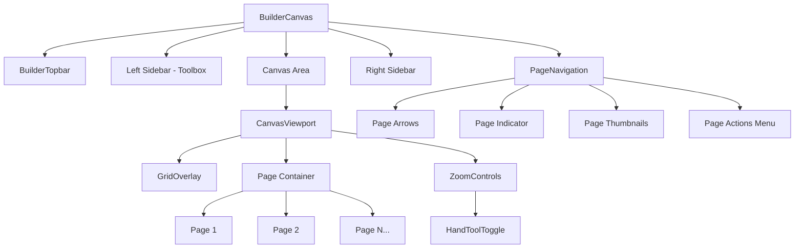

# Multi-Page Report Navigation & Management Design

## Overview

This document outlines the design for adding multi-page navigation and page management capabilities to the LabVIEW Report Builder. The implementation includes:

1. **Toggleable Hand Tool** - A pan/pan mode toggle for canvas navigation
2. **Bottom Bar Navigation** - Page navigation controls at the bottom of the canvas
3. **Page Management Operations** - Add, duplicate, delete, and reorder pages

## Current Architecture Analysis

### Existing Components

- [`BuilderCanvas.tsx`](components/builder/canvas/BuilderCanvas.tsx) - Main editor container using Craft.js
- [`Page.tsx`](components/builder/canvas/Page.tsx) - Single page component with settings
- [`CanvasViewport.tsx`](components/builder/layout/CanvasViewport.tsx) - Handles zoom/pan with spacebar
- [`builder-store.ts`](lib/stores/builder-store.ts) - Zustand store for builder state

### Current State Management

The builder currently manages:
- Single template with one canvas state
- Zoom and pan state
- Preview mode toggle
- Selected node tracking

## Proposed Architecture

### 1. Multi-Page Data Model

```typescript
// New types for multi-page support
interface ReportPage {
  id: string
  name: string
  canvasState: any // Craft.js serialized state
  settings: PageSettings
  order: number
}

interface PageSettings {
  background: string
  padding: number
  pageSize: PageSizePreset
  customWidth?: number
  customHeight?: number
}

// Updated template structure
interface Template {
  id: string
  name: string
  pages: ReportPage[]
  activePageId: string
  sampleData: Record<string, unknown>
}
```

### 2. Updated Builder Store

```typescript
interface BuilderState {
  // Existing state
  templateId: string | null
  templateName: string
  sampleData: Record<string, unknown> | null
  selectedNodeId: string | null
  isPreviewMode: boolean
  hasUnsavedChanges: boolean
  snapEnabled: boolean
  gridSize: number
  activeDrag: ActiveDrag | null
  zoom: number
  panX: number
  panY: number
  isPanning: boolean

  // New multi-page state
  pages: ReportPage[]
  activePageId: string
  
  // New hand tool state
  handToolEnabled: boolean

  // New actions
  setActivePage: (pageId: string) => void
  addPage: (afterPageId?: string) => void
  duplicatePage: (pageId: string) => void
  deletePage: (pageId: string) => void
  reorderPages: (fromIndex: number, toIndex: number) => void
  updatePageSettings: (pageId: string, settings: Partial<PageSettings>) => void
  
  // Hand tool actions
  toggleHandTool: () => void
  setHandTool: (enabled: boolean) => void
}
```

### 3. Component Architecture



## UI Components

### 1. Hand Tool Toggle

Location: Integrated into the existing zoom controls at bottom-right

```
┌─────────────────────────────────────────┐
│  [Hand Icon] │ [-] 100% [+] │ [Reset]   │
└─────────────────────────────────────────┘
```

- Toggle button with hand icon
- When active: cursor changes to grab/grabbing
- Visual indicator when hand tool is enabled
- Keyboard shortcut: H key to toggle

### 2. Bottom Bar Page Navigation

Location: Fixed bottom bar spanning the canvas area

```
┌──────────────────────────────────────────────────────────────────┐
│                                                                  │
│                        [Canvas Area]                             │
│                                                                  │
├──────────────────────────────────────────────────────────────────┤
│  [< Prev]  │  Page 1 of 5  │  [Next >]  │  [+ Add]  │  [···]    │
└──────────────────────────────────────────────────────────────────┘
```

Features:
- Previous/Next page arrows
- Current page indicator with total count
- Quick add page button
- Overflow menu for additional actions:
  - Duplicate Page
  - Delete Page
  - Page Settings

### 3. Page Thumbnails Panel (Optional/Expandable)

A collapsible panel showing page previews:

```
┌─────────────────────┐
│   PAGES             │
├─────────────────────┤
│  ┌─────┐ ┌─────┐    │
│  │  1  │ │  2  │    │
│  │     │ │     │    │
│  └─────┘ └─────┘    │
│  ┌─────┐ ┌─────┐    │
│  │  3  │ │  4  │    │
│  │     │ │     │    │
│  └─────┘ └─────┘    │
│                     │
│  [+ Add Page]       │
└─────────────────────┘
```

## User Interactions

### Hand Tool Behavior

| Action | Result |
|--------|--------|
| Click hand tool button | Toggles pan mode on/off |
| Press H key | Toggles pan mode on/off |
| Pan mode ON + click canvas | Cursor changes to grabbing |
| Pan mode ON + drag | Pans the canvas |
| Pan mode ON + component click | Does NOT select component |
| Pan mode OFF + click canvas | Normal selection behavior |

### Page Navigation

| Action | Result |
|--------|--------|
| Click Prev/Next | Navigates to adjacent page |
| Click page indicator | Opens page picker dropdown |
| Keyboard Left/Right | Navigate between pages |
| Scroll in canvas | Optionally auto-navigate pages |

### Page Management

| Action | Result |
|--------|--------|
| Click + Add | Creates new blank page after current |
| Drag page thumbnail | Reorders pages |
| Right-click page | Context menu with actions |
| Delete page | Confirmation if page has content |

## Implementation Steps

### Phase 1: Hand Tool Toggle

1. Add `handToolEnabled` state to builder store
2. Add toggle button to CanvasViewport zoom controls
3. Modify canvas cursor behavior based on hand tool state
4. Add H keyboard shortcut
5. Update panning logic to respect hand tool state

### Phase 2: Multi-Page State Management

1. Update builder store with multi-page state
2. Create page management actions
3. Update template serialization/deserialization
4. Add page change tracking for unsaved changes

### Phase 3: Page Navigation UI

1. Create PageNavigation component
2. Implement page indicator and arrows
3. Add page picker dropdown
4. Style to match existing oscilloscope theme

### Phase 4: Page Management Operations

1. Implement add page functionality
2. Implement duplicate page with state cloning
3. Implement delete page with confirmation
4. Implement drag-and-drop reordering

### Phase 5: Canvas Integration

1. Modify BuilderCanvas to switch between pages
2. Update Page component for multi-page context
3. Ensure proper state serialization per page
4. Handle page-specific undo/redo considerations

### Phase 6: Export Updates

1. Update export engine for multi-page PDFs
2. Ensure page numbers work across pages
3. Handle page breaks within multi-page context
4. Test batch export with multiple pages

## Technical Considerations

### State Persistence

Each page's Craft.js state must be serialized separately:

```typescript
// Saving template
const templateData = {
  id: template.id,
  name: template.name,
  pages: pages.map(page => ({
    id: page.id,
    name: page.name,
    canvasState: serializeCraftState(page.id),
    settings: page.settings,
    order: page.order
  })),
  sampleData: sampleData
}

// Loading template
pages.forEach(page => {
  deserializeCraftState(page.canvasState)
})
```

### Performance

- Lazy load page content when switching
- Virtual scrolling for page thumbnails if many pages
- Debounce thumbnail generation
- Consider page state caching

### Craft.js Integration

The current architecture uses a single Frame/Editor context. For multi-page:

**Option A: Multiple Editors (Recommended)**
- Each page has its own Editor context
- Only active page's editor is enabled
- Cleaner state isolation

**Option B: Single Editor with Page Nodes**
- Pages are special container nodes
- More complex state management
- Better for drag-across-pages

We recommend Option A for cleaner implementation.

## File Structure

```
components/builder/
├── canvas/
│   ├── BuilderCanvas.tsx      # Modified for multi-page
│   ├── Page.tsx               # Existing, minor updates
│   └── PageRenderer.tsx       # New: Renders active page
├── layout/
│   ├── CanvasViewport.tsx     # Modified for hand tool
│   └── ...
├── navigation/
│   ├── PageNavigation.tsx     # New: Bottom bar navigation
│   ├── PageIndicator.tsx      # New: Page number display
│   ├── PageThumbnails.tsx     # New: Thumbnail panel
│   └── PageActionsMenu.tsx    # New: Page actions dropdown
└── ...

lib/stores/
└── builder-store.ts           # Extended with multi-page state
```

## Database Schema Updates

```sql
-- Add pages table for multi-page support
CREATE TABLE report_pages (
  id UUID PRIMARY KEY DEFAULT gen_random_uuid(),
  template_id UUID REFERENCES templates(id) ON DELETE CASCADE,
  name TEXT DEFAULT 'Untitled Page',
  canvas_state JSONB DEFAULT '{}',
  settings JSONB DEFAULT '{}',
  page_order INTEGER DEFAULT 0,
  created_at TIMESTAMPTZ DEFAULT NOW(),
  updated_at TIMESTAMPTZ DEFAULT NOW()
);

-- Migrate existing canvas_state to first page
INSERT INTO report_pages (template_id, name, canvas_state, page_order)
SELECT id, 'Page 1', canvas_state, 0
FROM templates
WHERE canvas_state IS NOT NULL;
```

## Testing Checklist

- [ ] Hand tool toggles correctly
- [ ] H keyboard shortcut works
- [ ] Canvas pans with hand tool enabled
- [ ] Component selection disabled when hand tool active
- [ ] Page navigation arrows work
- [ ] Page indicator shows correct count
- [ ] Add page creates blank page
- [ ] Duplicate page copies all content
- [ ] Delete page removes and navigates correctly
- [ ] Page reordering persists
- [ ] Multi-page export generates correct PDF
- [ ] Page numbers display correctly across pages
- [ ] State persists after save/load
- [ ] Undo/redo works within page context

## Questions Resolved

1. **Hand Tool**: Toggleable button + H keyboard shortcut
2. **Navigation UI**: Bottom bar with arrows and page indicator
3. **Page Operations**: All operations (add, duplicate, delete, reorder)

## Next Steps

1. Review and approve this design
2. Switch to Code mode for implementation
3. Implement in phases as outlined above
4. Test each phase before moving to next
