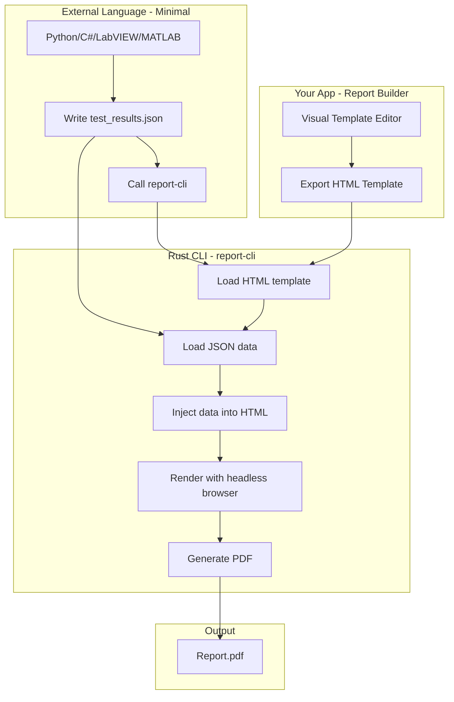
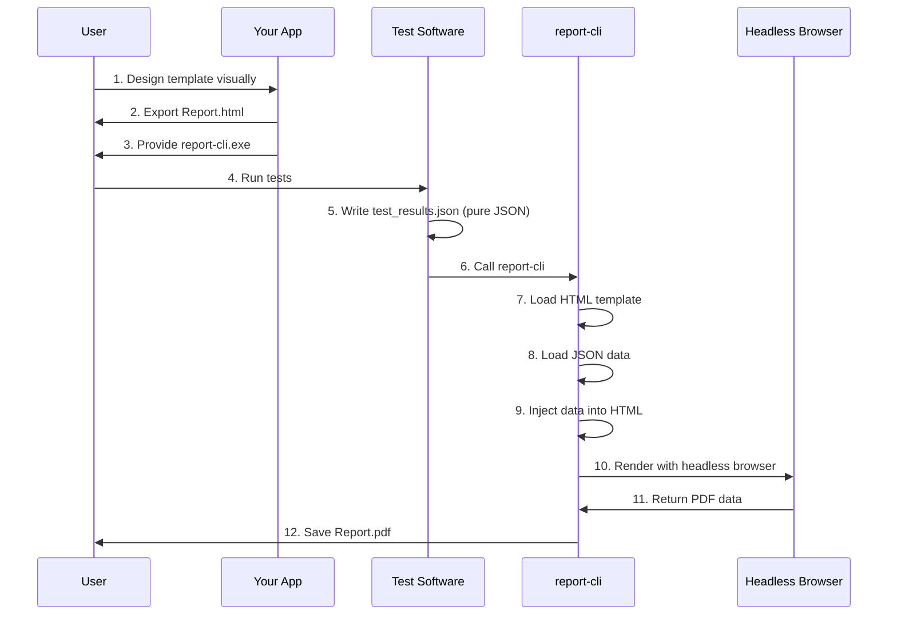

# Offline HTML Report Template - Approaches Analysis

## Problem Statement

The current [`Report.html`](Report.html) uses `fetch()` to load JSON data from an external file. However, `fetch()` does not work when opening HTML files directly from the filesystem (`file://` protocol) due to browser CORS security restrictions.

**Goal:** Create a fully offline, self-contained HTML report template where:
1. Test station generates JSON data with test results
2. HTML file is opened (or called) and parses the data
3. PDF is generated from the rendered report

---

## Current Implementation Issues

The current [`Report.html`](Report.html:705) attempts to:
```javascript
var response = await fetch(CONFIG.dataPath || './report_data.json');
```

This fails with error: `CORS policy: Cross origin requests are only supported for protocol schemes: http, data, chrome, chrome-extension, https.`

---

## Approach 1: Embedded JSON Data (Template Injection)

### How It Works
The test station (LabVIEW) reads the HTML template file, finds a placeholder marker, and replaces it with the actual JSON data before saving/opening the file.

### Implementation

**HTML Template with Placeholder:**
```html
<script>
  // Data placeholder - replaced by test station
  window.REPORT_DATA = null; // {{REPORT_DATA_PLACEHOLDER}}
</script>
```

**LabVIEW Process:**
1. Read HTML template file as string
2. Replace `null; // {{REPORT_DATA_PLACEHOLDER}}` with actual JSON
3. Save as new file (e.g., `Report_2026-03-01.html`)
4. Open in browser or send to PDF generator

### Pros
- ✅ Fully offline - no server needed
- ✅ Single self-contained HTML file
- ✅ Works with `file://` protocol
- ✅ Simple LabVIEW string manipulation
- ✅ No external dependencies

### Cons
- ❌ Requires modifying HTML file for each report
- ❌ Large JSON data increases HTML file size
- ❌ Need to manage file versions

### Best For
- One-time report generation
- Archival reports that need to be self-contained

---

## Approach 2: JSON Embedded as Data URI

### How It Works
Encode JSON as a Base64 data URI and embed it directly in the HTML.

### Implementation

```html
<script>
  // Embedded data as Base64
  const dataUri = "data:application/json;base64,eyAiZGF0YSI6IC4uLiB9";
  const reportData = JSON.parse(atob(dataUri.split(',')[1]));
</script>
```

**LabVIEW Process:**
1. Convert JSON to Base64
2. Inject into HTML template
3. Open file

### Pros
- ✅ Fully offline
- ✅ Self-contained
- ✅ Works with `file://` protocol

### Cons
- ❌ Base64 encoding increases size by ~33%
- ❌ More complex encoding step

### Best For
- Smaller data sets
- When binary-safe encoding is needed

---

## Approach 3: Local File Protocol Workaround (iframe/srcdoc)

### How It Works
Use an iframe with `srcdoc` attribute to embed content, which has different security context.

### Implementation
```html
<iframe id="dataFrame" srcdoc='{"data": ...}' style="display:none"></iframe>
<script>
  const data = JSON.parse(document.getElementById('dataFrame').contentDocument.body.innerHTML);
</script>
```

### Pros
- ✅ Alternative to script embedding

### Cons
- ❌ Still requires embedding data in HTML
- ❌ Complex implementation
- ❌ Not recommended for this use case

### Best For
- Not recommended - Approach 1 is simpler

---

## Approach 4: URL Fragment / Query Parameter

### How It Works
Pass data via URL fragment when opening the HTML file.

### Implementation
```html
<!-- Open as: Report.html#data=eyJkYXRhIjogLi4uIH0 -->
<script>
  const hash = window.location.hash;
  if (hash.startsWith('#data=')) {
    const jsonData = atob(hash.substring(6));
    window.REPORT_DATA = JSON.parse(jsonData);
  }
</script>
```

### Pros
- ✅ No modification to HTML file needed
- ✅ Can use same HTML file for all reports

### Cons
- ❌ URL length limits (~2KB to ~8KB depending on browser)
- ❌ Not suitable for large test result datasets
- ❌ Data visible in URL

### Best For
- Very small datasets
- Simple parameter passing

---

## Approach 5: Sidecar JSON File + Local Web Server

### How It Works
Keep JSON as separate file, but use a lightweight local server to serve files.

### Implementation Options

**Option A: Python Simple Server (if available)**
```bash
python -m http.server 8080 --directory /path/to/report
```

**Option B: Node.js http-server**
```bash
npx http-server /path/to/report -p 8080
```

**Option C: LabVIEW Built-in Web Server**
LabVIEW has a built-in web server capability that could serve the files.

### Pros
- ✅ Clean separation of data and template
- ✅ No modification to HTML files
- ✅ Works with existing fetch() code

### Cons
- ❌ Requires starting a web server
- ❌ Additional complexity in deployment
- ❌ Port conflicts possible

### Best For
- Development environments
- When Python/Node.js is already available

---

## Approach 6: Headless Chrome with Injected Data

### How It Works
Use Chrome/Chromium headless mode with `--allow-file-access-from-files` flag or inject data via command line.

### Implementation

**Using Chrome with file access:**
```bash
chrome --headless --allow-file-access-from-files --print-to-pdf=output.pdf Report.html
```

**Using Puppeteer (Node.js):**
```javascript
const puppeteer = require('puppeteer');
const fs = require('fs');

const htmlTemplate = fs.readFileSync('Report.html', 'utf8');
const jsonData = fs.readFileSync('report_data.json', 'utf8');

const htmlWithData = htmlTemplate.replace(
  'window.REPORT_DATA = null;',
  `window.REPORT_DATA = ${jsonData};`
);

(async () => {
  const browser = await puppeteer.launch();
  const page = await browser.newPage();
  await page.setContent(htmlWithData);
  await page.pdf({ path: 'output.pdf', format: 'A4' });
  await browser.close();
})();
```

### Pros
- ✅ Full control over PDF generation
- ✅ Can inject data programmatically
- ✅ High-quality PDF output
- ✅ No browser security restrictions in headless mode

### Cons
- ❌ Requires Chrome/Chromium installation
- ❌ Additional Node.js script or CLI knowledge needed
- ❌ More complex setup

### Best For
- Automated report generation pipelines
- Server-side report generation
- When PDF quality is critical

---

## Approach 7: Pre-built Executable / Wrapper

### How It Works
Create a small executable (using Electron, Tauri, or similar) that bundles a browser engine and handles data injection + PDF generation.

### Implementation

**Electron App:**
```javascript
// main.js
const { app, BrowserWindow } = require('electron');
const fs = require('fs');
const path = require('path');

app.whenReady().then(() => {
  const win = new BrowserWindow({ show: false });
  
  // Load HTML and inject data
  const html = fs.readFileSync('Report.html', 'utf8');
  const data = fs.readFileSync(process.argv[2], 'utf8'); // JSON file path from CLI
  
  const htmlWithData = html.replace(
    'window.REPORT_DATA = null;',
    `window.REPORT_DATA = ${data};`
  );
  
  win.loadURL('data:text/html;charset=utf-8,' + encodeURIComponent(htmlWithData));
  
  // Generate PDF
  win.webContents.printToPDF({}).then(pdf => {
    fs.writeFileSync('output.pdf', pdf);
    app.quit();
  });
});
```

### Pros
- ✅ Single executable - easy deployment
- ✅ Full control over process
- ✅ Can be called from LabVIEW via CLI
- ✅ No browser installation needed

### Cons
- ❌ Requires building and maintaining executable
- ❌ Larger file size for wrapper
- ❌ Platform-specific builds (Windows/Mac/Linux)

### Best For
- Production deployment
- Non-technical end users
- When ease of use is critical

---

## Approach 8: wkhtmltopdf

### How It Works
Use `wkhtmltopdf`, a command-line tool that uses Qt WebKit to render HTML to PDF.

### Implementation
```bash
wkhtmltopdf --enable-local-file-access Report.html output.pdf
```

### Pros
- ✅ Simple command-line tool
- ✅ Works with local files
- ✅ Good PDF quality
- ✅ Easy to call from LabVIEW

### Cons
- ❌ Requires installing wkhtmltopdf
- ❌ Uses older WebKit engine (may have compatibility issues)
- ❌ Less maintained than Chrome-based solutions

### Best For
- Simple reports without modern CSS/JS features
- Legacy system integration

---

## PDF Generation Libraries Comparison

| Library | Offline | Quality | Size | Complexity |
|---------|---------|---------|------|------------|
| Browser Print (Ctrl+P) | ✅ | Medium | N/A | Very Low |
| Chrome Headless | ✅ | Excellent | ~300MB | Medium |
| Puppeteer | ✅ | Excellent | ~300MB | Medium |
| jsPDF | ✅ | Good | ~500KB | Medium |
| html2pdf.js | ✅ | Good | ~1MB | Low |
| wkhtmltopdf | ✅ | Good | ~50MB | Low |
| Electron Wrapper | ✅ | Excellent | ~150MB | High |

---

## ✅ Recommended Solution: Rust CLI Tool

**A dedicated Rust CLI that handles everything** - external languages only write pure JSON!

### Value Proposition

| Your App Provides | External Language Does | Rust CLI Does |
|-------------------|------------------------|---------------|
| ✅ Visual template builder | ✅ Write pure JSON file | ✅ Load HTML template |
| ✅ All components (charts, tables, indicators) | ✅ That's it! | ✅ Load JSON data |
| ✅ Complete styling and layout | | ✅ Inject data into HTML |
| ✅ Export HTML template | | ✅ Generate PDF |
| | | ✅ Save output |

**External languages do the MINIMUM:**
- ✅ Write pure JSON file with test results
- ✅ Call the Rust CLI

---

### Architecture Overview



---

### How It Works

#### 1. Your App Generates HTML Template

The HTML template has a placeholder for data:

```html
<!DOCTYPE html>
<html>
<head>
  <title>Test Report</title>
  <script src="chart.min.js"></script>
</head>
<body>
  <div id="report">
    <!-- All your components here -->
  </div>

  <!-- Data placeholder - Rust CLI replaces this -->
  <script>
    window.REPORT_DATA = null; // {{REPORT_DATA_PLACEHOLDER}}
    
    // Fallback to sample data for preview
    if (!window.REPORT_DATA) {
      window.REPORT_DATA = { /* sample data for preview */ };
    }
    
    document.addEventListener('DOMContentLoaded', function() {
      initializeReport(window.REPORT_DATA);
    });
  </script>
</body>
</html>
```

#### 2. External Language Writes Pure JSON

**Python:**
```python
import json
import subprocess

# Test data - pure JSON, no JavaScript!
data = {
    "testName": "Temperature Stress Test",
    "result": "PASS",
    "measurements": [23.5, 24.1, 23.8]
}

# Write pure JSON file
with open('test_results.json', 'w') as f:
    json.dump(data, f, indent=2)

# Call Rust CLI
subprocess.run(['report-cli',
                '--template', 'Report.html',
                '--data', 'test_results.json',
                '--output', 'Report.pdf'])
```

**C#:**
```csharp
var data = new {
    testName = "Voltage Test",
    result = "PASS",
    measurements = new[] { 5.1, 5.0, 5.2 }
};

// Write pure JSON file
File.WriteAllText("test_results.json", JsonSerializer.Serialize(data));

// Call Rust CLI
Process.Start("report-cli",
    "--template Report.html --data test_results.json --output Report.pdf");
```

**LabVIEW:**
```
1. Build data cluster
2. Convert to JSON string (pure JSON)
3. Write to "test_results.json"
4. System Exec: report-cli --template Report.html --data test_results.json --output Report.pdf
```

**MATLAB:**
```matlab
data = struct('testName', 'Signal Test', 'result', 'PASS');
jsonwrite('test_results.json', data);
system('report-cli --template Report.html --data test_results.json --output Report.pdf');
```

#### 3. Rust CLI Does the Heavy Lifting

```bash
report-cli --template Report.html --data test_results.json --output Report.pdf
```

The Rust CLI:
1. Reads the HTML template file
2. Reads the JSON data file
3. Replaces `null; // {{REPORT_DATA_PLACEHOLDER}}` with the actual JSON
4. Uses a headless browser (via headless_chrome crate) to render
5. Generates PDF
6. Saves to output path

---

### Rust CLI Design

#### Command Line Interface

```bash
report-cli [OPTIONS] --template <FILE> --data <FILE> --output <FILE>

Options:
  -t, --template <FILE>     HTML template file path
  -d, --data <FILE>         JSON data file path
  -o, --output <FILE>       Output PDF file path
  -w, --wait <MS>           Wait time for JS rendering (default: 1000)
  -f, --format <FORMAT>     Page format: A4, Letter, Legal (default: A4)
  -m, --margin <MM>         Page margin in mm (default: 20)
      --no-header-footer    Exclude page headers/footers
  -v, --verbose             Verbose output
  -h, --help                Show help
  -V, --version             Show version
```

#### Example Usage

```bash
# Basic usage
report-cli -t Report.html -d test_results.json -o Report.pdf

# With custom options
report-cli --template Report.html \
           --data test_results.json \
           --output "Report_2026-03-01.pdf" \
           --wait 2000 \
           --format A4 \
           --margin 15 \
           --no-header-footer

# Verbose mode for debugging
report-cli -t Report.html -d data.json -o output.pdf -v
```

#### Rust Dependencies

```toml
[dependencies]
clap = { version = "4", features = ["derive"] }
headless_chrome = "1.0"
serde_json = "1.0"
anyhow = "1.0"
regex = "1.10"
```

#### Core Implementation (Skeleton)

```rust
use clap::Parser;
use headless_chrome::{Browser, protocol::page::PrintToPdfOptions};
use std::fs;
use anyhow::Result;

#[derive(Parser)]
#[command(name = "report-cli")]
#[command(about = "Generate PDF reports from HTML templates and JSON data")]
struct Cli {
    /// HTML template file path
    #[arg(short, long)]
    template: String,
    
    /// JSON data file path
    #[arg(short, long)]
    data: String,
    
    /// Output PDF file path
    #[arg(short, long)]
    output: String,
    
    /// Wait time for JS rendering (ms)
    #[arg(short, long, default_value = "1000")]
    wait: u64,
}

fn main() -> Result<()> {
    let args = Cli::parse();
    
    // 1. Read HTML template
    let html = fs::read_to_string(&args.template)?;
    
    // 2. Read JSON data
    let json_data = fs::read_to_string(&args.data)?;
    
    // 3. Inject data into HTML
    let filled_html = html.replace(
        "null; // {{REPORT_DATA_PLACEHOLDER}}",
        &json_data
    );
    
    // 4. Create temporary HTML file
    let temp_html_path = format!("{}.tmp.html", &args.output);
    fs::write(&temp_html_path, &filled_html)?;
    
    // 5. Launch headless browser and generate PDF
    let browser = Browser::default()?;
    let tab = browser.new_tab()?;
    
    tab.navigate_to(&format!("file:///{}", &temp_html_path))?;
    tab.wait_for_element("body")?;
    
    // Wait for JS to complete
    std::thread::sleep(std::time::Duration::from_millis(args.wait));
    
    // Generate PDF
    let pdf_data = tab.print_to_pdf(Some(PrintToPdfOptions {
        paper_width: Some(210.0 / 25.4),  // A4
        paper_height: Some(297.0 / 25.4), // A4
        margin_top: Some(20.0),
        margin_bottom: Some(20.0),
        margin_left: Some(20.0),
        margin_right: Some(20.0),
        print_background: Some(true),
        ..Default::default()
    }))?;
    
    // 6. Save PDF
    fs::write(&args.output, &pdf_data)?;
    
    // 7. Cleanup temp file
    fs::remove_file(&temp_html_path)?;
    
    println!("Report generated: {}", &args.output);
    
    Ok(())
}
```

---

### File Structure

```
C:\ReportSystem\
├── report-cli.exe           # Rust CLI tool (distributed by your app)
├── templates\
│   └── Report.html          # HTML template from your app
├── data\
│   └── test_results.json    # JSON from external language
└── output\
    └── Report_20260301.pdf  # Generated PDF
```

---

### Distribution

The Rust CLI can be:
1. **Downloaded from your website** as a standalone .exe
2. **Bundled with your app** installer
3. **Included in template exports** (optional)

**Advantages of Rust:**
- ✅ Single .exe file - no dependencies
- ✅ Small size (~5-10MB)
- ✅ Fast execution
- ✅ Cross-platform (Windows, macOS, Linux)
- ✅ No runtime installation needed

---

### Complete Workflow



---

### Advantages of This Approach

| Feature | Benefit |
|---------|---------|
| **Pure JSON** | External languages write standard JSON - no JavaScript knowledge needed |
| **Single CLI call** | One simple command to generate PDF |
| **No browser installation** | Rust CLI uses its own headless Chrome |
| **Cross-platform** | Works on Windows, macOS, Linux |
| **Fast** | Rust performance + no dependencies |
| **Easy distribution** | Single .exe file |
| **Offline** | Works completely offline |
| **Flexible** | Template and data are separate |

---

### Comparison with Previous Approaches

| Approach | External Language Work | Dependencies |
|----------|----------------------|--------------|
| Script Tags + Edge CLI | Write JS file, call Edge | Edge browser |
| **Rust CLI** | Write JSON, call CLI | None (self-contained) |
| Puppeteer | Write JSON, call Node.js | Node.js + Puppeteer |
| Embedded Data | Modify HTML file | None |

---

## Implementation Plan

### Phase 1: HTML Template Updates
- [ ] Modify [`Report.html`](Report.html) to use placeholder pattern
- [ ] Add `window.REPORT_DATA = null; // {{REPORT_DATA_PLACEHOLDER}}`
- [ ] Remove fetch() code
- [ ] Ensure all components read from `window.REPORT_DATA`
- [ ] Test with inline sample data

### Phase 2: Rust CLI Development
- [ ] Set up Rust project structure
- [ ] Implement CLI argument parsing with clap
- [ ] Implement HTML template loading
- [ ] Implement JSON data loading
- [ ] Implement data injection (string replacement)
- [ ] Implement headless browser PDF generation
- [ ] Add error handling
- [ ] Add verbose logging option

### Phase 3: Update Marketing Examples
- [ ] Update Python example in [`integrations.tsx`](components/marketing/integrations.tsx)
- [ ] Update C# example
- [ ] Update LabVIEW example
- [ ] Update MATLAB example
- [ ] Highlight "pure JSON" benefit

### Phase 4: Testing & Distribution
- [ ] Test CLI on Windows
- [ ] Test with various JSON data sizes
- [ ] Verify PDF output quality
- [ ] Create release builds (Windows, macOS, Linux)
- [ ] Document installation and usage

---

## Next Steps

1. ✅ Requirements clarified - Rust CLI approach
2. → Switch to Code mode to implement HTML template updates
3. → Create Rust CLI project
4. → Update marketing integrations page
5. → Test complete workflow

---

## Implementation Plan

### Phase 1: HTML Template Updates
- [ ] Modify [`Report.html`](Report.html) to use `<script src="report_data.js">`
- [ ] Remove fetch() code
- [ ] Add fallback error message if data not loaded
- [ ] Ensure all components read from `window.REPORT_DATA`
- [ ] Test with local `report_data.js` file

### Phase 2: Update Marketing Examples
- [ ] Update Python example in [`integrations.tsx`](components/marketing/integrations.tsx)
- [ ] Update C# example
- [ ] Update LabVIEW example
- [ ] Update MATLAB example
- [ ] Add note about `report_data.js` format

### Phase 3: Create Sample Files
- [ ] Create sample `report_data.js` for testing
- [ ] Document data structure/schema
- [ ] Add validation in HTML for required fields

### Phase 4: Testing
- [ ] Test opening HTML directly in browser (file://)
- [ ] Test PDF generation with Chrome CLI
- [ ] Test with Edge CLI
- [ ] Verify charts render correctly

---

## Next Steps

1. ✅ Requirements clarified - script tag approach
2. → Switch to Code mode to implement HTML template updates
3. → Update marketing integrations page with new examples
4. → Create sample `report_data.js`
5. → Test complete workflow
