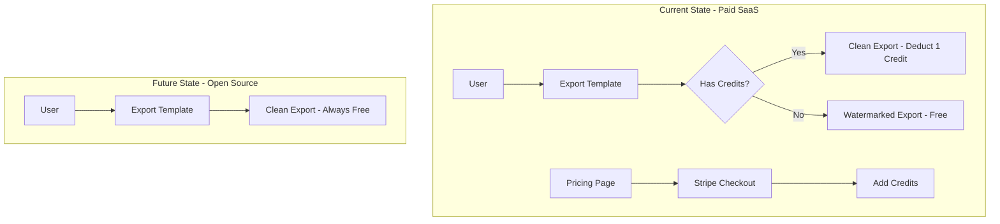

# Open Source Migration Plan

## Overview

This document outlines the plan to convert the LabVIEW Report Builder from a paid SaaS product to an open-source project that anyone can deploy and use for free.

## Current State Analysis

### Billing Infrastructure to Remove

| Component | Location | Description |
|-----------|----------|-------------|
| Stripe Client | [`lib/stripe/client.ts`](lib/stripe/client.ts) | Stripe SDK initialization |
| Stripe Config | [`lib/stripe/config.ts`](lib/stripe/config.ts) | Credit bundle definitions |
| Checkout API | [`app/api/billing/checkout/route.ts`](app/api/billing/checkout/route.ts) | Stripe checkout session creation |
| Webhook API | [`app/api/billing/webhook/route.ts`](app/api/billing/webhook/route.ts) | Stripe webhook handler |
| Credits API | [`app/api/billing/credits/route.ts`](app/api/billing/credits/route.ts) | Fetch user credit balance |
| Credit Balance Component | [`components/billing/credit-balance.tsx`](components/billing/credit-balance.tsx) | Display credits in UI |
| Pricing Cards | [`components/marketing/pricing-cards.tsx`](components/marketing/pricing-cards.tsx) | Pricing tier display |
| Pricing FAQ | [`components/marketing/pricing-faq.tsx`](components/marketing/pricing-faq.tsx) | Pricing FAQ section |
| Pricing Preview | [`components/marketing/pricing-preview.tsx`](components/marketing/pricing-preview.tsx) | Homepage pricing preview |
| Pricing Page | [`app/(marketing)/pricing/page.tsx`](app/(marketing)/pricing/page.tsx) | Full pricing page |

### Credit-Based Features to Modify

| Feature | Location | Current Behavior | New Behavior |
|---------|----------|------------------|--------------|
| Export Watermark | [`app/api/templates/[id]/export/route.ts`](app/api/templates/[id]/export/route.ts) | Deducts 1 credit for clean export | Always export clean (no watermark) |
| Batch Export | [`app/api/templates/batch-export/route.ts`](app/api/templates/batch-export/route.ts) | Deducts credits per template | Always export clean |
| Export Modal | [`components/builder/export/ExportModal.tsx`](components/builder/export/ExportModal.tsx) | Shows credit balance, credit options | Simplified export options |
| Settings Page | [`app/(app)/settings/page.tsx`](app/(app)/settings/page.tsx) | Shows credit balance section | Remove credit section |

### Database Schema Changes

The `profiles` table has a `credits` column that can be:
- **Option A**: Remove the column entirely (requires migration)
- **Option B**: Keep but ignore (simpler, backward compatible)

**Recommendation**: Option B for simplicity, Option A for clean schema.

### Environment Variables to Remove

```env
# Remove these from .env.example
STRIPE_SECRET_KEY=
STRIPE_WEBHOOK_SECRET=
STRIPE_STARTER_PRICE_ID=
STRIPE_PRO_PRICE_ID=
STRIPE_TEAM_PRICE_ID=
NEXT_PUBLIC_STRIPE_PUBLISHABLE_KEY=
```

---

## Migration Phases

### Phase 1: Remove Stripe/Billing Code

**Files to Delete:**
- `lib/stripe/client.ts`
- `lib/stripe/config.ts`
- `lib/stripe/` directory (entire)
- `app/api/billing/` directory (entire)

**Files to Modify:**
- Remove Stripe imports from any remaining files

### Phase 2: Remove Credits System

**Database Migration (Optional):**
```sql
-- Option A: Remove credits column
ALTER TABLE profiles DROP COLUMN credits;
```

**Files to Delete:**
- `components/billing/credit-balance.tsx`
- `components/billing/` directory (entire)

### Phase 3: Update Export Logic

**Files to Modify:**
- [`app/api/templates/[id]/export/route.ts`](app/api/templates/[id]/export/route.ts)
  - Remove credit check logic
  - Remove watermark option (always export clean)
  - Simplify the export options
  
- [`app/api/templates/batch-export/route.ts`](app/api/templates/batch-export/route.ts)
  - Remove credit check logic
  - Remove watermark option

- [`components/builder/export/ExportModal.tsx`](components/builder/export/ExportModal.tsx)
  - Remove credit balance display
  - Remove watermark toggle
  - Simplify to just export options

### Phase 4: Update Marketing Pages

**Files to Delete:**
- `app/(marketing)/pricing/page.tsx`
- `components/marketing/pricing-cards.tsx`
- `components/marketing/pricing-faq.tsx`
- `components/marketing/pricing-preview.tsx`

**Files to Modify:**
- [`app/(marketing)/page.tsx`](app/(marketing)/page.tsx) - Remove PricingPreview component
- [`components/marketing/navbar.tsx`](components/marketing/navbar.tsx) - Remove Pricing link
- [`components/marketing/footer.tsx`](components/marketing/footer.tsx) - Remove Pricing link
- [`components/marketing/hero.tsx`](components/marketing/hero.tsx) - Update CTA button
- [`components/marketing/cta.tsx`](components/marketing/cta.tsx) - Update CTA link

### Phase 5: Update Settings Page

**Files to Modify:**
- [`app/(app)/settings/page.tsx`](app/(app)/settings/page.tsx)
  - Remove CreditBalance component import
  - Remove credit balance card section

### Phase 6: Update Environment Variables

**Files to Modify:**
- [`.env.example`](.env.example) - Remove Stripe-related variables

### Phase 7: Update README

**Files to Modify:**
- [`README.md`](README.md)
  - Update installation instructions
  - Remove pricing/billing mentions
  - Add self-hosting section
  - Add deployment guides for popular platforms

### Phase 8: Testing

- [ ] Test export functionality (should work without credits)
- [ ] Test batch export
- [ ] Verify no broken links to pricing pages
- [ ] Verify settings page loads correctly
- [ ] Test clean build with no Stripe dependencies

---

## Decisions (Confirmed)

1. **Watermark Feature**: ✅ Remove completely - always export clean
2. **Database Migration**: ✅ Remove `credits` column from schema
3. **Pricing Page**: ✅ Redirect `/pricing` to homepage
4. **License**: ✅ MIT License

---

## Architecture Diagram



---

## Estimated Changes Summary

| Category | Files Deleted | Files Modified |
|----------|---------------|----------------|
| Stripe/Billing | 5 | 0 |
| Credits UI | 1 | 2 |
| Export Logic | 0 | 3 |
| Marketing | 4 | 5 |
| Settings | 0 | 1 |
| Config | 0 | 2 |
| **Total** | **10** | **13** |
